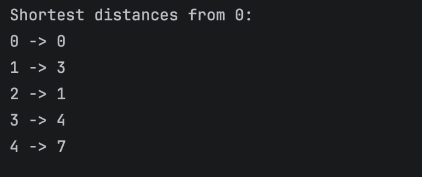

# Dijkstra Algorithm Implementation

## Description

This project implements Dijkstra’s Algorithm to find the shortest path from a starting vertex to all other vertices in a graph.

## Features

* Graph implemented using adjacency list
* Weighted edges
* Shortest path calculation
* Console output of distances

## Files

* Edge.java – represents a weighted edge
* Graph.java – graph structure and Dijkstra algorithm
* Main.java – program entry point

## How to Run

1. Compile all files:
   javac *.java

2. Run the program:
   java Main

## Example Output

Shortest distances from 0:

